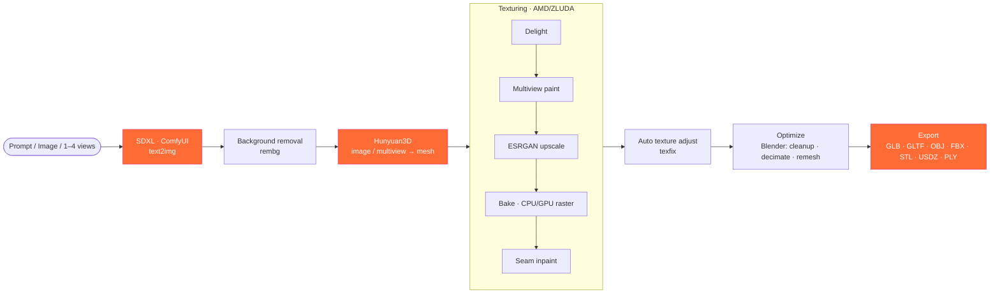
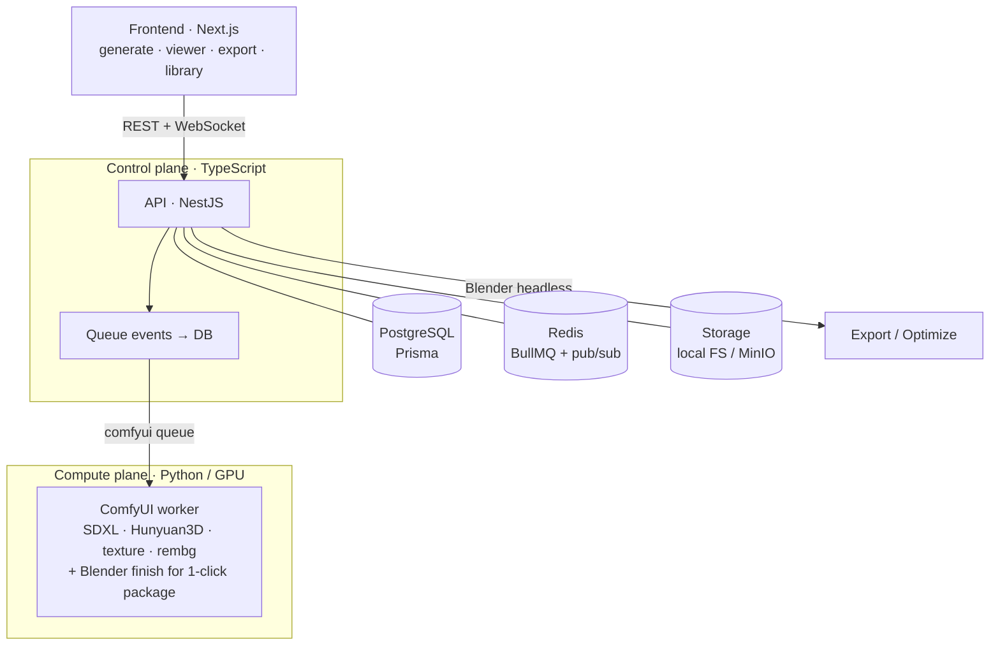

<div align="center">


<br/>

**A self-hosted, open-source pipeline that turns a prompt or an image into a production-ready, textured 3D asset — running on your own GPU.**

Powered end-to-end by free and open components — no proprietary clouds, no per-generation fees.

<br/>

[](LICENSE)
[](#roadmap)
[](#hardware)
[](#tech-stack)
[](#tech-stack)

[Overview](#overview) · [What works today](#what-works-today) · [Pipeline](#the-pipeline) · [Architecture](#architecture) · [Quickstart](#quickstart) · [Roadmap](#roadmap)

</div>

---

## Overview

**MeshForge** is a desktop / self-hosted platform for AI-driven 3D generation, inspired by tools
like Meshy — but built entirely on open-source models you run on your own hardware. It orchestrates
best-in-class projects into a single pipeline: a text prompt or image becomes a clean, **textured**
3D mesh you can optimize and export to any format.

| Stage | Engine | Role |
| :-- | :-- | :-- |
| 🎨 **Image generation** | [ComfyUI](https://github.com/comfyanonymous/ComfyUI) + [Stable Diffusion XL](https://stability.ai/) | Text-to-Image, Image-to-Image |
| 🧊 **3D generation** | [Hunyuan3D 2.0](https://github.com/Tencent/Hunyuan3D-2) | Image-to-3D, Text-to-3D, **Multi-image → 3D** (multiview) |
| 🖌️ **Texturing** | Hunyuan3D Paint + Delight + ESRGAN | PBR albedo, lighting-invariant, upscaled, **auto color/contrast adjust** |
| 🛠️ **Mesh processing & export** | [Blender](https://www.blender.org/) (headless) | Cleanup, decimate, **watertight remesh + re-bake**, multi-format export |
| 📦 **One-click pipeline** | orchestrated in a single job | Prompt → mesh → texture → optimize → export package |

> [!IMPORTANT]
> **It runs on AMD.** The entire stack — including Hunyuan3D's texture painting, which is officially
> CUDA-only — runs on an **AMD Radeon RX 7800 XT via [ZLUDA](https://github.com/vosen/ZLUDA)**. The
> texture rasterizer was compiled from source for both a CPU path and a GPU (CUDA-via-ZLUDA) path.

## What works today

Every item below is implemented **and validated end-to-end** (no mockups, no placeholders):

- ✅ **Text → Image** and **Image → Image** (SDXL on the GPU).
- ✅ **Image → 3D** and **Text → 3D** — a single chained generation (SDXL → background removal → Hunyuan3D → mesh).
- ✅ **Multi-image → 3D** — reconstruct a mesh from **1–4 views** (front/left/right/back) via
  `Hy3DGenerateMeshMultiView`, reusing the same base checkpoint (no extra model download).
- ✅ **One-click full pipeline** (`FULL_PIPELINE`) — prompt → image → mesh → texture → **auto texture
  adjust** → optimize (~20k) → multi-format export, all in **a single server-side job** (fire-and-forget).
- ✅ **Premium PBR texture** on AMD — Hunyuan3D **paint + delight** (clean, lighting-invariant albedo)
  **+ ESRGAN upscale + seam inpaint**, baked at up to **2048²**.
- ✅ **Automatic texture adjustment** (`texfix`) — hue-preserving auto levels + saturation on the baked albedo.
- ✅ **Quality tiers** (Balanced / High / Max) — dial geometry detail (octree, face count) and texture resolution.
- ✅ **Two texture rasterizer backends**, selectable per generation from the UI: **CPU** (recommended)
  and **GPU** (CUDA kernels via ZLUDA) — both compiled from the Hunyuan3D `custom_rasterizer`.
- ✅ **Mesh optimization** (Blender headless) — cleanup (weld, loose, normals, holes), **decimate**
  (e.g. 100k → 15k faces, texture preserved), and **watertight voxel remesh with texture re-bake (EMIT)**.
- ✅ **Professional export** — GLB · GLTF · OBJ · FBX · STL · USDZ · PLY (textures preserved).
- ✅ **Open-source 3D gallery** — browse & import CC0 models from multiple sources (ToxSam, Khronos,
  Poly Haven; Poly Pizza opt-in).
- ✅ **Real-time 3D viewer** (react-three-fiber): materials, wireframe, original texture, turntable.
- ✅ **Platform**: real-time progress over WebSocket, queue (BullMQ), history, projects, health checks,
  a self-healing **ComfyUI supervisor**, a safe tool **`update`** manager, tests + CI.

> A simple prompt like *"a cute red mushroom"* yields a photoreal, textured 3D mushroom — geometry,
> red cap with cream dots, textured stem — fully on AMD.

## The pipeline



Each stage is reusable on its own — progress streams to the UI in real time, and you can run them
individually (generate, then optimize, then export). The **one-click pipeline** (`FULL_PIPELINE`) chains
the whole chain in a **single server-side job** that emits every artifact (preview, textured mesh,
optimized mesh, exports) at once — fire-and-forget.

## Architecture



**Design principle:** a clear split between the **control plane** (TypeScript: API, DB, queue) and the
**compute plane** (Python GPU worker). The worker is stateless — reads inputs from storage, writes
outputs back, and never touches the database (the API reflects queue events into Postgres). On-demand
mesh optimize/export run via Blender headless straight from the API; the **one-click pipeline** lets the
worker also finish the package (optimize + multi-format export, CPU) in the same job.

See **[ARCHITECTURE.md](ARCHITECTURE.md)** and the operational **[RUNBOOK.md](RUNBOOK.md)**.

## Tech stack

<table>
<tr><td><b>Frontend</b></td><td>Next.js · React · TypeScript · Tailwind · react-three-fiber · @tanstack/react-query</td></tr>
<tr><td><b>Backend</b></td><td>NestJS · BullMQ · WebSockets · Prisma</td></tr>
<tr><td><b>AI / 3D</b></td><td>Python · ComfyUI · SDXL · Hunyuan3D (shape + paint + delight) · rembg · ESRGAN · Blender (headless)</td></tr>
<tr><td><b>GPU runtime</b></td><td>AMD RX 7800 XT via ZLUDA (HIP/ROCm) · custom_rasterizer compiled CPU + GPU</td></tr>
<tr><td><b>Data / Infra</b></td><td>PostgreSQL · Redis · local FS (S3-like) / MinIO · Docker Compose · pnpm monorepo · GitHub Actions CI</td></tr>
</table>

## Hardware

MeshForge runs the full stack locally and is GPU-bound. Reference machine: **AMD Radeon RX 7800 XT
(16 GB)** + 32 GB RAM, Windows, via **ZLUDA** (HIP SDK 6.x). The quality presets and texture settings
are calibrated for **16 GB VRAM** (sequential model loading; views at 256–384 to avoid OOM).

| Tier | GPU | Notes |
| :-- | :-- | :-- |
| Reference | 16 GB (RX 7800 XT) | Validated end-to-end, incl. premium texture |
| Recommended | 16–24 GB (AMD or NVIDIA) | More headroom for higher view/texture sizes |

> On NVIDIA the same pipeline runs natively (CUDA). The AMD/ZLUDA path is the hard-won one — see
> **[RUNBOOK.md](RUNBOOK.md)** for the launchers and the lessons learned.

## Quickstart

> **Prerequisites:** Node 20+ · pnpm · Docker Desktop · Git · Python 3.11 · a GPU + its runtime
> (AMD: HIP SDK + ZLUDA / NVIDIA: CUDA). ComfyUI (with the Hunyuan3D wrapper), Blender and the models
> are managed under `auxiliary-tools/`.

```bash
git clone https://github.com/SnoWz96x/meshforge.git
cd meshforge
pnpm install
pnpm infra:up            # Postgres + Redis (+ MinIO)
pnpm db:generate && pnpm db:migrate
```

Then bring up the engine and the app (see **[RUNBOOK.md](RUNBOOK.md)** for the exact order and the
ComfyUI launchers):

```bash
# 1) ComfyUI on the GPU — prefer the supervisor (auto-restart):
powershell -ExecutionPolicy Bypass -File tools/bootstrap/comfyui-supervisor.ps1
# 2) API · 3) Python worker · 4) web
pnpm --filter @meshforge/api dev      # :3001
pnpm --filter @meshforge/web dev      # :3000  → http://localhost:3000
```

| Service | URL |
| :-- | :-- |
| Web UI | http://localhost:3000 |
| API | http://localhost:3001 |
| ComfyUI | http://localhost:8188 |
| Postgres | `localhost:5433` |

## Project structure

```
meshforge/
├── apps/             web (Next.js) · api (NestJS — generate, assets, export/optimize, gallery)
├── services/
│   ├── comfyui-service/   Python worker: SDXL · Hunyuan3D shape+multiview+texture · rembg · 1-click finish
│   └── blender-service/   headless export_mesh.py · process_mesh.py (cleanup/decimate/remesh/texfix)
├── packages/         shared-types · db (Prisma) · queue · storage
├── tools/
│   ├── bootstrap/         ComfyUI/ZLUDA launchers · supervisor
│   ├── custom-rasterizer-cpu/   CPU build of Hunyuan3D rasterizer (+ patches)
│   └── custom-rasterizer-gpu/   GPU (CUDA-via-ZLUDA) build
├── infra/            docker-compose
├── auxiliary-tools/  ComfyUI / Hunyuan3D / Blender / models  (managed, git-ignored)
└── assets/           brand assets
```

> Honest, detailed status: **[REQUIREMENTS_TRACKING.md](REQUIREMENTS_TRACKING.md)** ·
> **[CHANGELOG.md](CHANGELOG.md)** · **[AUDIT.md](AUDIT.md)**

## Roadmap

| Area | Milestone | Status |
| :-- | :-- | :-- |
| Foundation | Monorepo, Docker infra, DB schema, tool/model managers | ✅ |
| 2D generation | SDXL via ComfyUI on AMD/ZLUDA, jobs, queue, storage | ✅ |
| 3D generation | Hunyuan3D Image→3D and Text→3D, live 3D viewer | ✅ |
| **Texturing** | Premium PBR on AMD (paint + delight + upscale + inpaint), 2 backends | ✅ |
| Quality | Tiers (geometry + texture), per-generation engine selector | ✅ |
| Mesh processing | Blender headless cleanup + decimate + watertight remesh (re-bake) | ✅ |
| Texture finishing | Auto texture adjustment (`texfix`, hue-preserving) | ✅ |
| Export | GLB / GLTF / OBJ / FBX / STL / USDZ / PLY | ✅ |
| Gallery | Browse & import open-source CC0 models (multi-source) | ✅ |
| Multi-image → 3D | Reconstruct from 1–4 views (multiview, no extra model) | ✅ |
| Orchestration | One-click full pipeline (prompt → textured → optimized → exported) | ✅ |
| Tooling | Safe `update` manager (rollback, dirty-tree guard) | ✅ |
| Hardening | Tests, CI, structured logs, ComfyUI supervisor, RUNBOOK | ✅ |
| Advanced (open) | Pure quad retopology (QuadriFlow) · native GPU rasterizer (Backend B) | ⬜ |
| Infra (future) | Auth · observability · distributed workers · Kubernetes | ⬜ |

## Acknowledgements

MeshForge stands on the shoulders of giants — huge thanks to
[ComfyUI](https://github.com/comfyanonymous/ComfyUI),
[Stability AI / SDXL](https://stability.ai/),
[Tencent Hunyuan3D](https://github.com/Tencent/Hunyuan3D-2),
[Blender](https://www.blender.org/),
[ZLUDA](https://github.com/vosen/ZLUDA) and
[rembg](https://github.com/danielgatis/rembg).

## Contributing

Contributions are welcome — please read **[CONTRIBUTING.md](CONTRIBUTING.md)** first. It covers the
ground rules (additive changes, no placeholders, validate end-to-end), the full pre-commit gate
(`format:check` · `lint` · `typecheck` · `test` · `pytest`), Conventional Commits, and the
environment gotchas.

## License

Released under the **GNU AGPL-3.0**. See [LICENSE](LICENSE).

> The integrated models (SDXL, Hunyuan3D) carry their own licenses with usage restrictions — review
> them before any commercial use.

<div align="center">
<br/>
<sub>Built with ⚙️ + 🔥 — forge meshes, not boilerplate.</sub>
</div>
