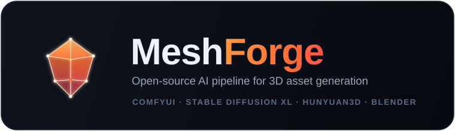
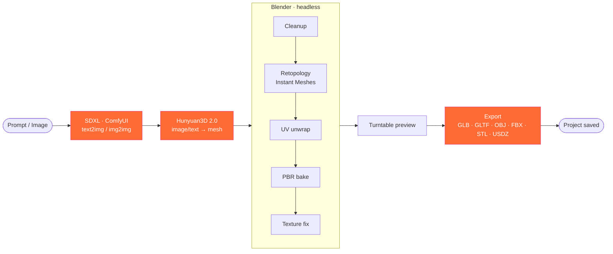
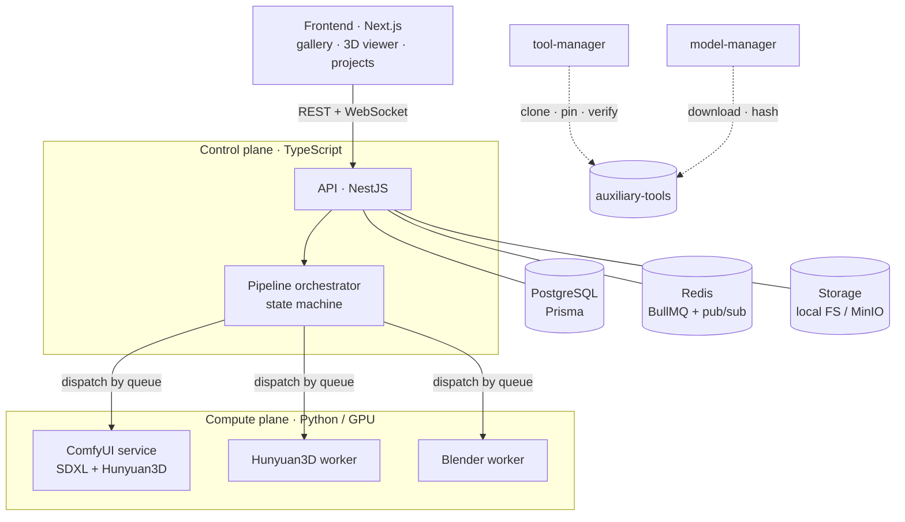

<div align="center">



<br/>

**A self-hosted, open-source pipeline that turns a prompt or an image into a production-ready 3D asset.**

Powered end-to-end by free and open components — no proprietary clouds, no per-generation fees.

<br/>

[](LICENSE)
[](#roadmap)
[](#roadmap)
[](#tech-stack)
[](#tech-stack)
[](#quickstart)

[Overview](#overview) · [Pipeline](#the-pipeline) · [Architecture](#architecture) · [Quickstart](#quickstart) · [Roadmap](#roadmap)

</div>

---

## Overview

**MeshForge** is a desktop / self-hosted platform for AI-driven 3D generation, inspired by tools
like Meshy — but built entirely on open-source models you run on your own hardware. It orchestrates
four best-in-class projects into a single, automated pipeline:

| Stage | Engine | Role |
| :-- | :-- | :-- |
| 🎨 **Image generation** | [ComfyUI](https://github.com/comfyanonymous/ComfyUI) + [Stable Diffusion XL](https://stability.ai/) | Text-to-Image, Image-to-Image, base assets |
| 🧊 **3D generation** | [Hunyuan3D 2.0](https://github.com/Tencent/Hunyuan3D-2) | Image-to-3D, Text-to-3D, initial mesh |
| 🛠️ **Mesh processing** | [Blender](https://www.blender.org/) (headless) + [Instant Meshes](https://github.com/wjakob/instant-meshes) | Retopology, UV, baking, texturing |
| 📦 **Export** | Blender exporters | GLB · GLTF · OBJ · FBX · STL · USDZ |

> [!NOTE]
> These four engines are **first-class citizens of the core pipeline** — not optional plugins.
> MeshForge manages their installation, versioning and updates automatically.

## Why MeshForge

- **Fully local & private** — your prompts, images and models never leave your machine.
- **One-command bootstrap** — installs dependencies, clones tools, downloads models, configures DB, queue and storage.
- **Automated end-to-end** — from prompt to a clean, retopologized, textured, multi-format export, with zero manual steps in Blender.
- **Hardware-aware** — a pluggable GPU backend (`ZLUDA · ROCm · CUDA · DirectML`) runs the same pipeline on AMD or NVIDIA.
- **Resumable & observable** — every pipeline stage is a first-class, retryable job with full history.

## The pipeline



Each box is an **independent, idempotent job**. A failure in any stage retries only that stage —
the expensive 3D generation is never recomputed because retopology hiccuped. A GPU lock prevents
SDXL and Hunyuan3D from competing for VRAM.

## Architecture



**Design principle:** a clear split between the **control plane** (TypeScript: API, DB, queue, orchestration)
and the **compute plane** (Python GPU workers). Workers are stateless — they read inputs from storage,
write outputs back, and update job state in the database.

See **[ARCHITECTURE.md](ARCHITECTURE.md)** for the full design, data model and decision log.

## Tech stack

<table>
<tr><td><b>Frontend</b></td><td>Next.js · React · TypeScript · Tailwind · shadcn/ui · react-three-fiber</td></tr>
<tr><td><b>Backend</b></td><td>NestJS · BullMQ · WebSockets</td></tr>
<tr><td><b>AI / 3D workers</b></td><td>Python · ComfyUI · Hunyuan3D · Blender (headless)</td></tr>
<tr><td><b>Data</b></td><td>PostgreSQL · Prisma · Redis</td></tr>
<tr><td><b>Storage</b></td><td>Local filesystem (S3-compatible abstraction) · MinIO (optional)</td></tr>
<tr><td><b>Infra</b></td><td>Docker · Docker Compose · pnpm monorepo</td></tr>
</table>

## Quickstart

> **Prerequisites:** Node 20+ · pnpm · Docker Desktop · Git · Python 3.10+ · a supported GPU (see [Hardware](#hardware)).

```powershell
# Windows
git clone https://github.com/SnoWz96x/meshforge.git
cd meshforge
./install.ps1                      # full bootstrap (infra + deps + tools + models)
```

```bash
# Linux / WSL2 / macOS
git clone https://github.com/SnoWz96x/meshforge.git
cd meshforge
./install.sh
```

Skip the heavy downloads while developing:

```powershell
./install.ps1 -SkipTools -SkipModels
```

Then:

```bash
pnpm db:migrate     # create the schema (first run)
pnpm dev            # start the services in dev mode
```

| Service | URL |
| :-- | :-- |
| Web UI | http://localhost:3000 |
| API | http://localhost:3001 |
| MinIO console | http://localhost:9001 |
| Postgres | `localhost:5433` |

## Hardware

MeshForge runs the full stack locally and is therefore GPU-bound.

| Tier | GPU | Notes |
| :-- | :-- | :-- |
| Recommended | 16–24 GB VRAM (RX 7800 XT / RTX 4080 / 4090 / 3090) | Comfortable SDXL + Hunyuan3D with sequential offload |
| Minimum | 12 GB VRAM | Aggressive offload, slower |

The GPU backend is configurable per worker via `GPU_BACKEND` (`zluda` · `rocm` · `cuda` · `directml`),
so the same pipeline runs on **AMD (ZLUDA / ROCm)** or **NVIDIA (CUDA)**.

## Project structure

```
meshforge/
├── apps/             web (Next.js) · api (NestJS)
├── services/         comfyui · hunyuan3d · blender · pipeline-orchestrator
├── packages/         shared-types · db (Prisma) · queue · ui
├── tools/            bootstrap · tool-manager · model-manager
├── infra/            docker-compose, Dockerfiles
├── auxiliary-tools/  ComfyUI / Hunyuan3D / Blender  (managed, git-ignored)
└── assets/           brand assets
```

## Roadmap

| Phase | Milestone | Status |
| :-- | :-- | :-- |
| **0** | Foundation — monorepo, Docker infra, DB schema, tool-manager | ✅ Done |
| **1** | Tool & Model Manager — model downloads | ✅ Done |
| **2** | 2D generation — SDXL via ComfyUI on AMD/ZLUDA, jobs, queue, storage | ✅ Done |
| **3** | 3D generation — Hunyuan3D worker, live 3D viewer | ⬜ |
| **4** | Blender pipeline — retopo, UV, bake, texturing | ⬜ |
| **5** | Orchestration — full pipeline, retries, GPU lock | ⬜ |
| **6** | Export — GLB/GLTF/OBJ/FBX/STL/USDZ + previews | ⬜ |
| **7** | Premium UI — gallery, projects, generation | 🚧 Milestone 1 done (web shell + generate + library) |
| **8** | Hardening & docs | ⬜ |

> Estado detalhado e honesto: [REQUIREMENTS_TRACKING.md](REQUIREMENTS_TRACKING.md) · [ROADMAP.md](ROADMAP.md)

## Acknowledgements

MeshForge stands on the shoulders of giants. Huge thanks to the teams behind
[ComfyUI](https://github.com/comfyanonymous/ComfyUI),
[Stability AI / SDXL](https://stability.ai/),
[Tencent Hunyuan3D](https://github.com/Tencent/Hunyuan3D-2),
[Blender](https://www.blender.org/) and
[Instant Meshes](https://github.com/wjakob/instant-meshes).

## License

Released under the **GNU AGPL-3.0**. See [LICENSE](LICENSE).

> Note: the integrated models (SDXL, Hunyuan3D) carry their own licenses with usage restrictions —
> review them before any commercial use.

<div align="center">
<br/>
<sub>Built with ⚙️ + 🔥 — forge meshes, not boilerplate.</sub>
</div>
